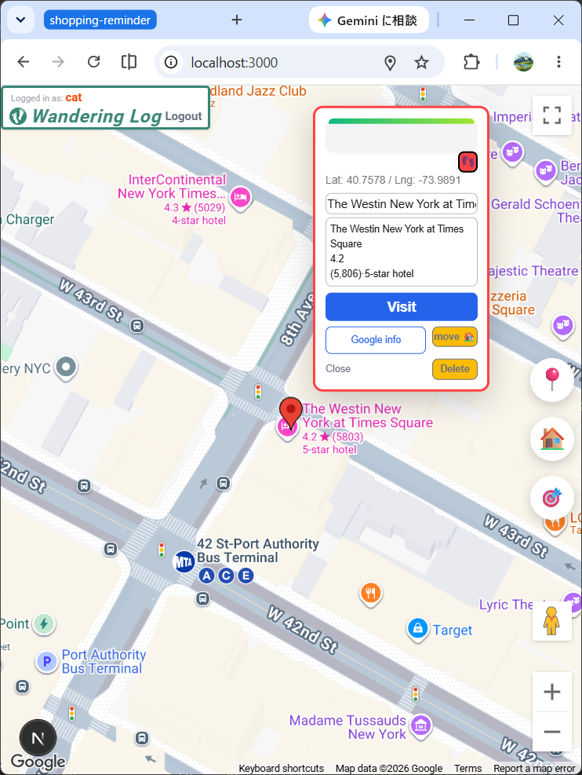

# README wandering-log(公開版)

# README.md

# Wondering-Log

## プロジェクト名: wandering-log

## １)概要説明

　地域や分野を問わず訪問先での記録を残すため、googleMapAPIを用いて、地図上で場所を指定し記録が残せるようなアプリを開発しました。google情報を取得して利用できるとともに、google情報が存在しない場合でも自分で情報を入力し、記録することができます。最初は、酒場放浪記をイメージして開発を始めたので、それに因んだアプリ名になっていますが、ビジネスシーンの営業活動や旅行での日記代わりなどの利用もできます。
　地図上でのマーカーやモーダルの動作を工夫し、使いやすさにこだわって作成しました。今回は記録して直接閲覧する基本機能までですが、今後は、さらに登録情報の検索やリスト表示など、追加機能も実装していきたいと思っております。

デプロイＵＲＬ：[https://wandering-log.vercel.app](https://wandering-log.vercel.app/)

【スマホで新規訪問先を登録】



【パソコンで訪問先を閲覧】


### 【機能概要】

①訪問先登録機能
　・訪問先位置（緯度、経度）、名称、コメントを登録します。  

②google情報取得機能
　・訪問先のgoogle情報（名称、住所、カテゴリ、TEL、E-mail）を取得し、保存します。

③訪問履歴表示機能
　・訪問先の訪問履歴を表示します。

④訪問メモ機能
　・訪問日ごとにメモやコメントを保存できます。

④画面移動機能
　・現在地移動ボタン　取得した現在地に画面を移動します。
　・Home移動ボタン　登録したHome地点に画面を移動します。
　・赤マーカー降臨ボタン　赤マーカーを画面の中央地点に移動します。

⑤モーダル操作
　・モーダル移動　モーダルの位置を移動します。
　・モーダルフォーカス機能　同じ訪問先のモーダルをフォーカスし、最前面に表示します。
　・モーダル整列機能　同じ訪問先のモーダルを整列させます。
　・モーダルフロート機能　任意のモーダルを最前面に表示します。

**操作方法**

①ユーザー登録、ログインは通常の操作になっています。

② 訪問先登録
　赤マーカーを移動し、目的地店をポイントします。
　赤マーカーをクリックするとLacatoinモーダルが表示されるので名称を確認して訪問するをク　　リック。赤マーカーの下に黄マーカーができたら成功です。
　ボタン
　・Google情報：Googleモーダルが立ち上がり取得したgoogle情報が表示されます。
　　　　　　　　ボタンクリックでgoogleMapページやウェブサイトが閲覧できます。
　　　　　　　　「…を反映」ボタンでgoogle情報が登録され親モーダルに反映されます。
　・🏠登録：現在の地点をHomeとして登録します。

③ 既存訪問先
　黄マーカーをクリックするとLacationモーダルが表示されます。名称、コメントが編集可能。
　ボタン
　・訪問する：訪問履歴に現在の日時が追加されます。表示情報も登録されます。
　・保存する：表示情報が登録されます。
　・Google情報：Googleモーダルが立ち上がり取得したgoogle情報が表示されます。
　　　　　　　　ボタンクリックでgoogleMapページやウェブサイトが閲覧できます。
　　　　　　　　「…を反映」ボタンでgoogle情報が登録され親モーダルに反映されます。
　・訪問記録：Logsモーダルが表示されこれまでに訪問した日時がリスト表示されます。　　　　　　　　　　表示された日時をクリックするとcomentモーダルが開きます。
　　　　　　　comentモーダルではコメントを編集し保存できます。

④モーダル操作
　モーダルはグレーのエリアをドラッグすることで自由の移動できます。
　・フォーカス機能：モーダルをクリックすると同じグループのモーダルが赤枠で囲まれ、最前
　　面に表示されます。
　・整列機能：Locationモーダルを100px以上移動させると同じグループのモーダルが集合して　　　　　　　　整列します。
　・フロート機能：表示されている任意のモーダルをダブルクリックすると最前面に表示され
　　ます。
 　　

## ２)作成した目的

ポートフォリオ作成

## ３)アプリケーションＵＲＬ

**GitHubリポジトリURL :** git@github.com:oxnut134/wandering-log.git

```jsx
git clone git@github.com:oxnut134/wandering-log.git
```

## ４）機能一覧

```jsx
ユーザー登録
ログイン・ログアウト
訪問先登録機能
google情報取得機能
訪問履歴表示機能
訪問メモ機能

```

## ５）使用技術

### フロントエンド

- **Next.js** 16.2.0（Turbopack）
- **React** 19.2.4
- **Google Maps JavaScript API**
- **Google Places API**
- **React-Hook-Form** 7.75.0

### バックエンド

- **Next.js** 16.1.6（Turbopack）
- **NextAuth.js**
- **Neon（PostgreSQL）**

## ６)テーブル設計

### テーブル仕様

**1. `users` (ユーザー登録情報：登録したユーザーの　Name、Email、password)**

「その日時の訪問」に対して、メモやコメントを残します。

| **カラム名** | **型** | **説明** | null |
| --- | --- | --- | --- |
| **id** | Serial (PK) | コメントの識別子 |  |
| **name** | text |  ユーザー名 |  |
| **email** | text | Eメール | 〇 |
| **password** | text | パスワード | 〇 |
| **updated_at** | Timestamp | 更新登録日 |  |
| **created_at** | Timestamp | 初回登録日 |  |

**2. `visited_locations` (位置：地球上の座標と基本情報)**

中心となる「地点」のテーブルです。座標とこの場所のメモやコメントを保持します。

| **カラム名** | **型** | **説明** | null |
| --- | --- | --- | --- |
| **id** | Serial (PK) | 地点の識別子 |  |
| user_id | Integer (FK) | ユーザーID |  |
| **latitude** | Decimal | 緯度 |  |
| **longitude** | Decimal | 経度 |  |
| **name** | Text | `店名、施設名、ビル名など` | 〇 |
| **comment** | Text | `comment_modal` で入力したメモ | 〇 |
| **updated_at** | Timestamp | 更新登録日 |  |
| **created_at** | Timestamp | 初回登録日 |  |

**3. `visited_places` (場所：Googleから取得した施設実体)**

その地点に紐づく「お店」や「施設」の情報です。`place_modal` で扱います。

| **カラム名** | **型** | **説明** | null |
| --- | --- | --- | --- |
| **id** | Serial (PK) | 施設としての識別子 |  |
| **location_id** | Integer (FK) | `visited_locations.id` への参照 |  |
| **google_place_id** | String | Google固有のID (重複排除・再検索用) | 〇 |
| **name** | Text | 店名、施設名、ビル名など | 〇 |
| **category** | Text | 分類　(居酒屋、アパレルなど） | 〇 |
| **address** | Text | 住所 | 〇 |
| **updated_at** | Timestamp | 更新登録日 |  |
| **created_at** | Timestamp | 初回登録日 |  |

**4. `visited_logs` (訪問履歴：いつ、そこへ行ったか)**

「場所」に対して、何度訪れたかを記録する履歴データです。

| **カラム名** | **型** | **説明** | null |
| --- | --- | --- | --- |
| **id** | Serial (PK) | 履歴の識別子 |  |
| **user_id** | Integer (FK) | `user.id` への参照 |  |
| **location_id** | Integer (FK) | `visited_location.id` への参照 | 〇 |
| **place_id** | Integer (FK) | `visited_places.id` への参照 | 〇 |
| **visited_at** | Timestamp | 訪問日 |  |
| **updated_at** | Timestamp | 更新登録日 |  |
| **created_at** | Timestamp | 初回登録日 |  |

**5. `visited_comments` (訪問メモ：訪問時のメモ、コメント)**

「その日時の訪問」に対して、メモやコメントを残します。

| **カラム名** | **型** | **説明** | null |
| --- | --- | --- | --- |
| **id** | Serial (PK) | コメントの識別子 |  |
| **user_id** | Integer (FK) | `user.id` への参照 |  |
| **log_id** | Integer (FK) | `visited_log.id` への参照 | 〇 |
| **comment** | text | `コメント` | 〇 |
| **updated_at** | Timestamp | 更新登録日 |  |
| **created_at** | Timestamp | 初回登録日 |  |

## ７)ＥＲ図


## ８）環境構築

## ８－１)基本構成

今回のプロジェクトはフロントエンドとバックエンドを一体化しNext.jsで構築しました。プロジェクトディレクトリはwandering-logとして、その直下のapp/apiにバックエンドを配置しました。

### ディレクトリ構成

```
C:\Users\user\..\wandering-log
├── AGENTS.md
├── app
|  ├── api/
|  ├── components/
|  ├── context/
|  └── page.tsx
├── lib/
├── public/
├── README.md
├── wandering-log.drawio
└── wandering-log.png
```

### プロジェクトclone作成

```jsx
       git clone git@github.com:oxnut134/wandering-log.git
```

## ８－２）フロントエンドの立ち上げ

### Next.js

**ライブラリのインストール**

```jsx
　　　　npm install
　　　　　※node_modulesフォルダが作成される。
```

**環境設定ファイルの作成**

```jsx
　　copy null > .env.local (cmd)
　　New-Item .env.local  (PowerShell)

　　.env.localに
　　　　NEXT_PUBLIC_GOOGLE_MAPS_API_KEY =
　　　　DATABASE_URL =
     を記述
```

**Next.js起動こで**

```jsx
　npm run dev
```

## ８－３）バックエンドの立ち上げ

本プロジェクトでは Neon（PostgreSQL）を用いてSQL 環境を構築しています。

```jsx
npx drizzle-kit push
```

/lib/schema.ts（参考）

```tsx
import { pgTable, serial, text, timestamp, integer, numeric } from "drizzle-orm/pg-core";

// 1. users (ユーザー)
export const users = pgTable("users", {
  id: serial("id").primaryKey(),
  name: text("name"),
  email: text("email").unique(),
  password: text("password").notNull(),
  updated_at: timestamp("updated_at").defaultNow().notNull(),
  created_at: timestamp("created_at").defaultNow().notNull(),
});

// 2. visited_locations (位置)
export const visitedLocations = pgTable("visited_locations", {
  id: serial("id").primaryKey(),
  user_id: integer("user_id").references(() => users.id, { onDelete: 'cascade' }),
  latitude: numeric("latitude", { precision: 10, scale: 7 }).notNull(),
  longitude: numeric("longitude", { precision: 10, scale: 7 }).notNull(),
  name: text("name"),
  comment: text("comment"),
  updated_at: timestamp("updated_at").defaultNow().notNull(), 
  created_at: timestamp("created_at").defaultNow().notNull(), 
});

// 3. visited_places (場所)
export const visitedPlaces = pgTable("visited_places", {
  id: serial("id").primaryKey(),
  location_id: integer("location_id").references(() => visitedLocations.id, { onDelete: 'cascade' }),
  google_place_id: text("google_place_id"),
  name: text("name"),
  category: text("category"),
  address: text("address"),
  updated_at: timestamp("updated_at").defaultNow().notNull(),
  created_at: timestamp("created_at").defaultNow().notNull(),
});

// 4. visited_logs (訪問履歴)
export const visitedLogs = pgTable("visited_logs", {
  id: serial("id").primaryKey(),
  location_id: integer("location_id").references(() => visitedLocations.id, { onDelete: 'cascade' }),
  user_id: integer("user_id").references(() => users.id, { onDelete: 'cascade' }),
  place_id: integer("place_id").references(() => visitedPlaces.id, { onDelete: 'cascade' }),
  visited_at: timestamp("visited_at").defaultNow().notNull(),
  updated_at: timestamp("updated_at").defaultNow().notNull(),
  created_at: timestamp("created_at").defaultNow().notNull(),
});

// 5. visited_comments (訪問コメント)
export const visitedComments = pgTable("visited_comments", {
  id: serial("id").primaryKey(),
  user_id: integer("user_id").references(() => users.id, { onDelete: 'cascade' }),
  log_id: integer("log_id").references(() => visitedLogs.id, { onDelete: 'cascade' }),
  comment: text("comment"),
  updated_at: timestamp("updated_at").defaultNow().notNull(),
  created_at: timestamp("created_at").defaultNow().notNull(),
});

```